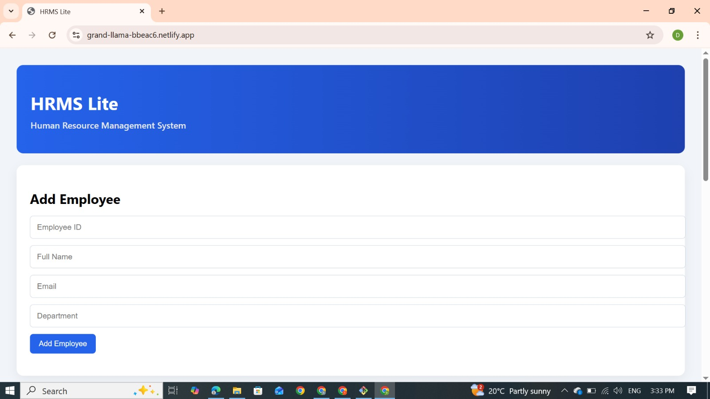
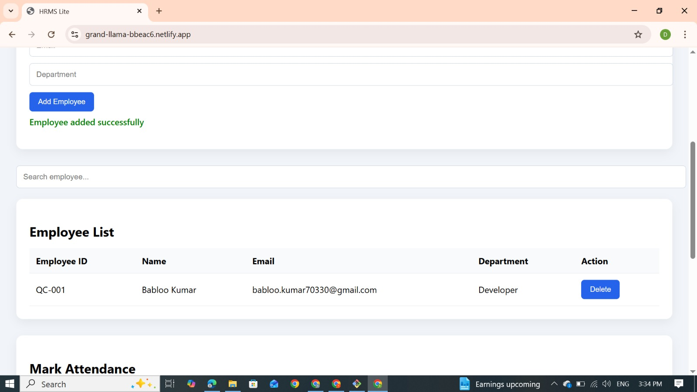
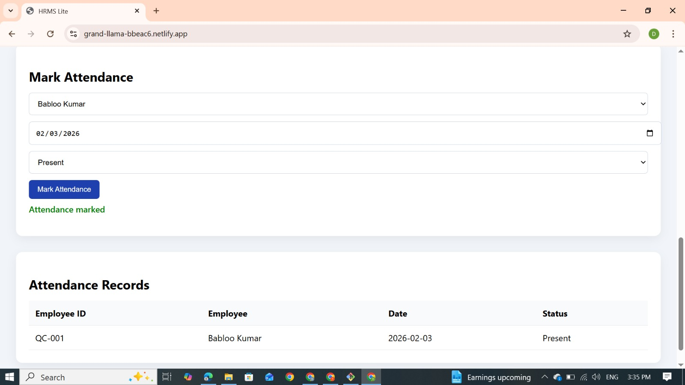
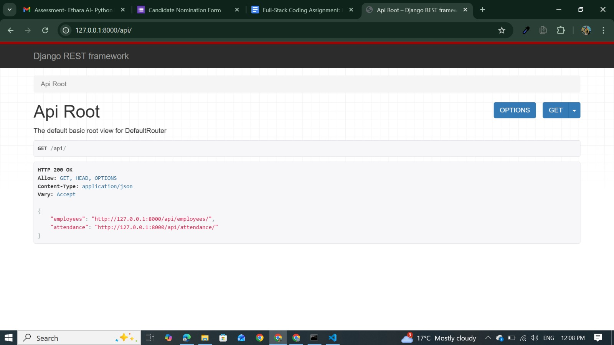
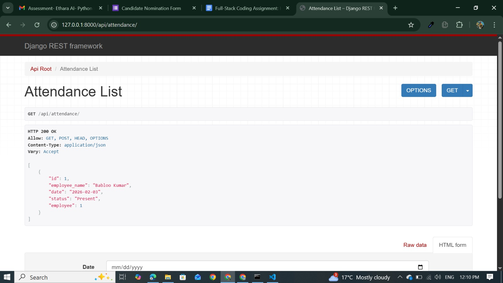

# HRMS Lite – Full Stack Assignment

HRMS Lite is a lightweight Human Resource Management System built as part of a full-stack coding assignment.  
The application allows an admin to manage employee records and track daily attendance using a clean, professional interface.

The project demonstrates end-to-end development skills including frontend integration, REST API design, database persistence, validations, and live deployment.

---

## Live Application

- **Frontend (Netlify):**  
  https://grand-llama-bbeac6.netlify.app/

- **Backend API (Render):**  
  https://hrms-lite-backend-xps9.onrender.com/api/

---

## Features

### Employee Management
- Add a new employee with:
  - Employee ID (unique)
  - Full Name
  - Email Address
  - Department
- View list of all employees
- Delete an employee
- Client-side validations for required fields
- Server-side validation for duplicate employees

### Attendance Management
- Mark daily attendance (Present / Absent)
- Prevent duplicate attendance for the same employee and date
- View attendance records with:
  - Employee ID
  - Employee Name
  - Date
  - Status

---

## Tech Stack

### Frontend
- HTML
- CSS
- Vanilla JavaScript

### Backend
- Django
- Django REST Framework

### Database
- SQLite (used for simplicity and lightweight setup)

### Deployment
- **Backend:** Render
- **Frontend:** Netlify

---


## 📸 Screenshots

### Employee Management – Add & List Employees


### Employee List View


### Attendance Management


### API Root (Django REST Framework)


### Employees API Response


## Project Structure

```text
hrms-lite/
│
├── backend/
│   ├── backend/
│   ├── employees/
│   ├── manage.py
│   └── requirements.txt
│
├── frontend/
│   ├── index.html
│   ├── style.css
│   └── app.js
│
├── README.md
└── .gitignore


